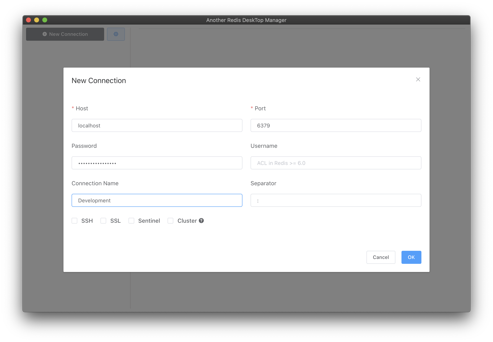

### Docker Compose Collection

Command :
```bash
docker-compose -f $FILENAME up -d
docker-compose -f $FILENAME down -v
```

### Redis

By default there are 16 databases (indexed from 0 to 15) and you can navigate between them using `select` command. Number of databases can be changed in redis config file with `databases` setting.

**Redis CLI**

Run `redis-cli`

```bash
docker exec -it redis redis-cli
```

Select the Redis logical database having the specified zero-based numeric index. New connections always use the database 0.

Change database.

```bash
select [INDEX]
```

Set and get key

```bash
set [KEY_NAME] [VALUE]
get [KEY_NAME]
```


**Redis Browser**

Go to `localhost:5001` fill host `redis` container. Default is `172.17.0.1`.



Redis Browser Dashboard

