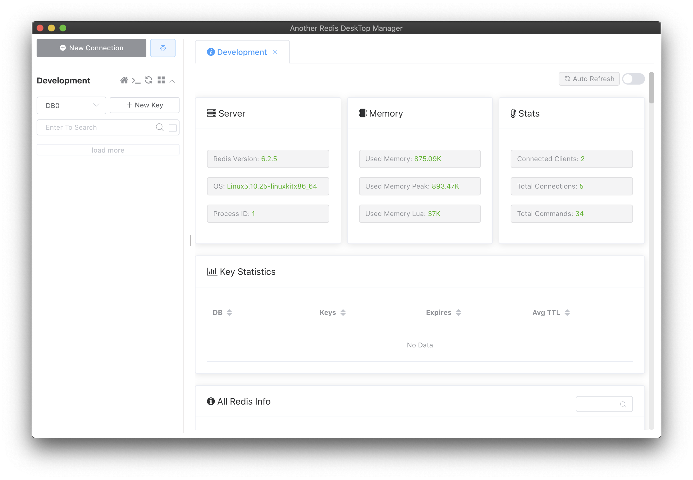

# Docker Compose Collection

I created this docker configuration pool so that when I forget the configuration environment, I can reuse it.

Basic command :
```bash
docker-compose -f $FILENAME up -d
docker-compose -f $FILENAME down -v
```

## Kafka CLI

Download docker compose configuration using curl

```bash
curl -o kafka-cli.yml https://raw.githubusercontent.com/piinalpin/docker-compose-collection/master/kafka-cli.yml
```

This yaml `kafka-cli.yaml` will create a new container `zookeeper` and exposed port `2181` on host port. Also create a new container `kafka` and exposed port `29092`, `9092` and `9101` on host port.

## Redis

By default there are 16 databases (indexed from 0 to 15) and you can navigate between them using `select` command. Number of databases can be changed in redis config file with `databases` setting.

Download docker compose configuration using curl

```bash
curl -o redis.yml https://raw.githubusercontent.com/piinalpin/docker-compose-collection/master/redis.yml
```

This yaml `redis.yaml` will create a new container `redis` and exposed port `6379` on host port.

**Redis CLI**

Run `redis-cli`

```bash
docker exec -it redis redis-cli
```

Select the Redis logical database having the specified zero-based numeric index. New connections always use the database 0.

Change database.

```bash
select [INDEX]
```

Set and get key

```bash
set [KEY_NAME] [VALUE]
get [KEY_NAME]
```

**Redis Browser**

Go to `localhost:5001` fill host `redis` container. Default is `172.17.0.1`.


Redis Browser Dashboard



## MySQL

Download docker compose configuration using curl

```bash
curl -o mysql.yml https://raw.githubusercontent.com/piinalpin/docker-compose-collection/master/mysql.yml
```

This yaml `mysql.yaml` will create a new container `mysql` and exposed port `3306` on host port.

Create network `my-network` if does not exists

```bash
docker network create my-network
```

Create volume `mysql-data` to persist data then run `docker-compose`

```bash
docker volume create mysql-data
```

**MySQL CLI**

Run this command to run MySQL command on container. Default user is `root` and password `SevenEightTwo782` you can change the password in `yaml` file.

```bash
docker exec -it mysql bash
```

**Basic command:**

-   Login into database, then type your password
    ```bash
    mysql -u root -p
    ```
-   Get list of databases
    ```sql
    show databases;
    ```
-   Create database and use database
    ```sql
    create database $DB_NAME;
    use $DB_NAME;
    ```
## PostgreSQL

Download docker compose configuration using curl

```bash
curl -o postgresql.yml https://raw.githubusercontent.com/piinalpin/docker-compose-collection/master/postgresql.yml
```

This yaml `postgresql.yaml` will create a new container `postgresql` and exposed port `5432` on host port.

Create network `my-network` if does not exists

```bash
docker network create my-network
```

Create volume `postgre-data` to persist data then run `docker-compose`

```bash
docker volume create postgre-data
```

**Postgre SQL CLI**

Run this command to run PostgreSQL command on container. Default user is `postgres` and password `SevenEightTwo782` you can change the password in `yaml` file.

```bash
docker exec -it postgresql bash
```

**Basic command:**

-   Login into database
    ```bash
    psql -Upostgres -w
    ```
-   Get list of databases
    ```sql
    \l
    ```
-   Create database and use database
    ```sql
    create database $DB_NAME;
    \c $DB_NAME
    ```

## SQL Server

Download docker compose configuration using curl

```bash
curl -o sqlserver.yml https://raw.githubusercontent.com/piinalpin/docker-compose-collection/master/sqlserver.yml
```

This yaml `sqlserver.yaml` will create a new container `sqlserver` and exposed port `1433` on host port.

Create network `my-network` if does not exists

```bash
docker network create my-network
```

Create volume `sqlserver-data` and `sqlserver-user` to persist data then run `docker-compose`

```bash
docker volume create sqlserver-data && docker volume create sqlserver-user
```

**SQL Server CLI**

Run this command to run SQL Server command on container. Default user is `sa` and password `SevenEightTwo782` you can change the password in `yaml` file.

```bash
docker exec -it sqlserver /opt/mssql-tools/bin/sqlcmd -U sa -P SevenEightTwo782
```

**Basic command:**

-   Get list of databases
    ```sql
    select name from sys.databases
    go
    ```
-   Create database and use database
    ```sql
    create database $DB_NAME
    go
    ```

## RabbitMQ

Download docker compose configuration using curl

```bash
curl -o rabbitmq.yml https://raw.githubusercontent.com/piinalpin/docker-compose-collection/master/rabbitmq.yml
```

This yaml `rabbitmq.yaml` will create a new container `rabbitmq` and exposed port `5672` and `15672` on host port.

Create network `my-network` if does not exists

```bash
docker network create my-network
```

Create volume `rabbitmq-data` and `rabbitmq-log` to persist data then run `docker-compose`

```bash
docker volume create rabbitmq-data && docker volume create rabbitmq-log
```

**RabbitMq Management**

Default RabbitMQ management user is `guest` and password is `guest`. Go to `localhost:15672` to acess RabbitMQ management.


## Sonarqube

Download docker compose configuration using curl

```bash
curl -o sonarqube.yml https://raw.githubusercontent.com/piinalpin/docker-compose-collection/master/sonarqube.yml
```

This yaml `sonarqube.yaml` will create a new container `sonarqube` and exposed port `9000` and `9002` on host port.

Create network `my-network` if does not exists

```bash
docker network create my-network
```

Create volume to persist data then run `docker-compose`

```bash
docker volume create sonarqube-data && docker volume create sonarqube-extensions && docker volume create sonarqube-logs && docker volume create sonarqube-temp
```

**Sonarqube Management**

Default Sonarqube management user is `admin` and password is `admin`. Go to `localhost:9000` to acess Sonarqube management and then change the default password first.

